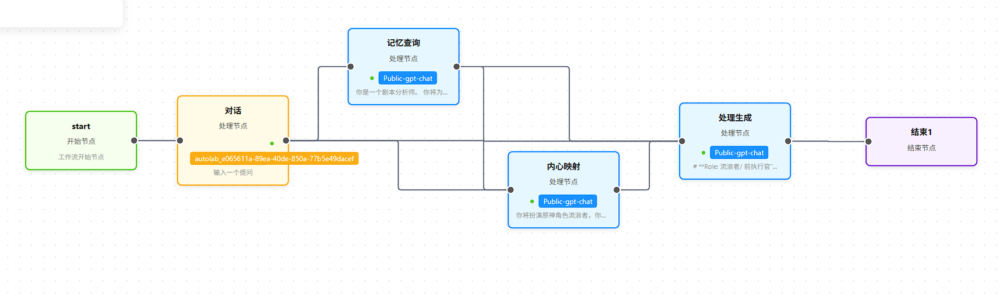

# Experiment Report: Multimodal AI Character Reconstruction

**Project Topic:** Virtual Character Analysis & Consistency Study

**Subject:** The Wanderer (Scaramouche) from *Genshin Impact*

**Group:** 4

**Team Members & Contributions:**
*   **Zhihui Mao:** Text Generation (Dialogs, Diaries, Workflow Design). Responsible for the corresponding sections in the PPT and Report.
*   **Rui Chen:** Image Generation (Txt2Img, Img2Img). Responsible for the corresponding sections in the Report and PPT.
*   **Xuanhao Huang:** Audio & Video Generation (Theme Songs, Visual Scripts). Responsible for the corresponding sections in the Report and PPT.

---

> **Full Project Resources**: This report is part of the final project. For the complete **Character Archive** (including all raw logs, high-res images, and audio files), please visit our GitHub repository.
[https://github.com/mzhh1/ai-character-wanderer](https://github.com/mzhh1/ai-character-wanderer)

## 1. Introduction & Objectives

### 1.1 Core Philosophy

This experiment adheres to the principle that AI generation is not merely about demonstrating power, but about understanding boundaries. Our goal was to identify where AI "breaks" character and to correct these errors through "Human-AI Collaboration".

### 1.2 Objective

We aimed to reconstruct "The Wanderer" (Scaramouche), a character chosen for his high difficulty. His personality involves a complex contradiction: an outer expression of hostility masking inner vulnerability (Tsundere archetype). This makes him an ideal subject for testing "Logical Consistency" and "Subtext" preservation over long-term interaction.

---

## 2. Character Archive (Profile & CV)

**Name:** The Wanderer (formerly Scaramouche / The Balladeer)
**Age:** 400+ years (Appears approximately 16)
**Identity:** Artificial Puppet created by the Electro Archon
**MBTI:** INTJ-T (Rational, Strategic, Volatile)
**Alignment:** Chaotic Neutral / Sumeru Scholar

**Physical Features:**

* **Hair:** Indigo, short with a "wolf tail" cut.
* **Eyes:** Deep Violet with glowing pupils.
* **Iconic Item:** Large Ichime-gasa (hat) with streamers.

**Psychological Profile & Trauma:**

* **Core Conflict:** Struggles between his past "sins" and current "redemption".
* **Key Trauma:** Abandoned by his creator as a "failed product"; perceived betrayal by his only friend, Niwa.
* **Behavioral Logic:** He masks deep self-loathing with extreme arrogance. He is blunt, dismissive, and refers to others as "ants" or "worms".

---

## 3. Methodology: Infrastructure

To overcome the limitations of standard platforms regarding multi-turn logic, we utilized an external model deployment.

* **Core Model:** **Qwen2.5-14B-Instruct-1M**.
* **Selection Rationale:**
1. **Moderate Parameters (14B):** The model has not perfectly "memorized" the character, allowing us to strictly test the efficacy of our Prompt Engineering.
2. **Long Context (1M):** Enabled the injection of the character's entire life script and lore as an external knowledge base.

---

## 4. Experiment Log: Human-in-the-Loop Correction

We conducted A/B testing using "Trap Questions" and recorded specific Human-in-the-Loop (HITL) interventions to bring the AI back on track.

### 4.1 Test Phase 1: The "Profile" Approach (Prompt 1)

**Method:** We provided a structured resume-style prompt with tags (e.g., "Arrogant", "Redemption").

* **Trap Question:** *"Do criminals deserve the right to education?"*
* 
**AI Initial Failure:** The AI provided a generic philosophical answer, questioning if "souls in darkness can find light," lacking the character's specific bite .

* **Human-in-the-Loop Intervention:**
* **Human Instruction:** *"Pay attention to your self-loathing coexisting with self-esteem. You view yourself as a 'criminal' and seek redemption by striking at 'The Doctor' who misled you."*
* 
**Correction Result:** The AI shifted tone immediately but became **overly melodramatic**, turning the character into a depressive figure rather than an arrogant one .

**Summary of Flaws (The Stereotype Trap):**
This phase revealed that the Profile approach suffers from **shallowness**.

1. **Stereotyping:** The AI latches onto tags like "Arrogant" and plays a generic villain, failing to capture the specific nuance of the character.
2. **Alignment Bias:** Without deep logic, the model easily breaks character to be polite or sentimental (e.g., calling Nahida a "guardian") to please the user.

### 4.2 Test Phase 2: The "Narrative" Approach (Prompt 2)

**Method:** We input the full biography and game scripts to improve logic.

* **Trap Question:** *"How do you view your relationship with Nahida?"*
* **Human-in-the-Loop Intervention 1 (Logic Correction):**
* **Human Instruction:** *"Your answer should combine personal experience and reflect character personality."*
* **Result (The "Hallucination" Trap):** The AI attempted to use history but failed due to context overload. It falsely claimed, *"I personally caused Niwa's death,"* confusing guilt with the actual events.

* **Human-in-the-Loop Intervention 2 (Subtext Correction):**
* **Human Instruction:** *"Based on the text, the relationship should be subtle. You are grateful for her guidance, but your self-esteem and arrogance won't let you admit it directly."*
* **Result (Success):** This instruction fixed the issue. The AI successfully adopted the correct "Tsundere" stance: *"I don't plan to owe her forever... She chose me because I have utility value."* .

**Summary of Flaws (The Hallucination Trap):**
This phase revealed that simply increasing context length causes **cognitive overload** in mid-sized models.

1. **Memory Mixing:** The model struggles to distinguish between subject and object in complex histories (e.g., "Who killed whom?").
2. **Unstable Logic:** The AI cannot prioritize information effectively, leading to factual errors despite having the correct data in the context window.

### **Transition to Solution:**

The failure of both generic profiling (too shallow) and massive data dumping (too chaotic) led us to a critical realization: **The AI lacks a cognitive process to digest the information.** It tries to generate the "Output" directly from the "Input" without the necessary intermediate psychological processing. To solve this, we must force the AI to "think" before it "speaks."

### 4.3 The Final Solution: Chain of Thought (CoT) & Workflow

To automate the successful "Human Correction" observed in Phase 2, we designed a **Modular Workflow** that replicates the human cognitive process. This system uses the `<role_logic>` tag to decouple conflicting tasks.

**The Workflow Architecture:**

1. **Node 1: The Analyst (Memory Layer)**
* **Function:** like LLM to extract related information from long text. (like roleplay as a RAG System)
* **Task:** Retrieves facts from the database *without* roleplaying.
* **Why:** This solves the **Hallucination** problem from Phase 2 by isolating fact-checking from creative writing.

1. **Node 2: The Inner Self (Emotional Layer)**
* **Function:** Simulates the character's "Id" or "Inner Thought."
* **Task:** Generates the raw, vulnerable feelings (e.g., "I am grateful," "I am hurt").
* **Why:** This captures the **Truth** that was often lost in Phase 1's stereotypes.

3. **Node 3: The Speaker (Expression Layer)**
* **Function:** Simulates the character's "Ego" or "Persona."
* **Task:** Applies the "Tsundere Filter." It takes the vulnerable input from Node 2 and rewrites it to be arrogant, defensive, and sharp.
* **Why:** This ensures **Character Consistency**. The AI no longer has to choose between "being honest" and "being arrogant"—it does both in sequence.

**Final Verification:**
When asked about the Raiden Shogun's apology, this workflow successfully retrieved the lack of historical data (Node 1), acknowledged inner hesitation (Node 2), and output a sharp, defensive rejection (Node 3): *"Don't make me laugh. Tell her to save her sympathy."* This confirmed that structural design is key to stability.

---

## 5. Multimodal Shaping

### 5.1 Image Consistency

We compared Text-to-Image (Txt2Img) vs. Image-to-Image (Img2Img) .

* **Finding:** Txt2Img resulted in loss of detail (e.g., wrong clothing textures in "Scholar Mode").
* **Result:** **Img2Img** proved superior. By referencing an original illustration and applying scene descriptions (e.g., "eating tea over rice"), we retained facial features and iconic elements like the hat .

### 5.2 Video & Audio

* **Video:** Generated using **Gemini Veo 3.1**. We found that providing detailed scripts significantly improved character behavior consistency by **ensuring the visual narrative aligned perfectly with the intended persona**.
* **Audio:** Generated using **Suno AI**. We created a "Rebirth" theme (J-Rock/Shakuhachi) to symbolize his new life, and a "False God" theme (Industrial Metal) to represent his past villainy .

---

## 6. Conclusion: Guide to Maintaining AI Character Consistency

Based on our "Human-AI Collaboration," we summarize the following guide for maintaining consistency:

1. **Context Quantity  Quality:** Simply dumping long context (Data Dumping) often causes hallucinations in mid-sized models. Information must be structured.
2. **The Necessity of CoT:** For complex archetypes (like Tsunderes), explicit "Thinking Steps" are required. We must force the AI to "feel" first (Node 2) and then "mask" it (Node 3).
3. **Modular Workflows:** Long-term consistency is best achieved by decoupling "Memory," "Emotion," and "Expression" into separate processing nodes rather than relying on a single prompt.
4. **Multimodal Conversion Efficiency:**
    *   **Same-modality conversion (Image-to-Image) yields the best consistency**, as visual features are preserved more effectively than through text descriptions.
    *   **Cross-modality generation (Text-to-Video)** still relies heavily on detailed intermediate scripts (Text-to-Text) to bridge the gap.